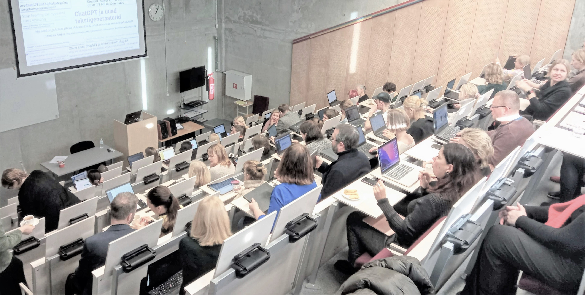
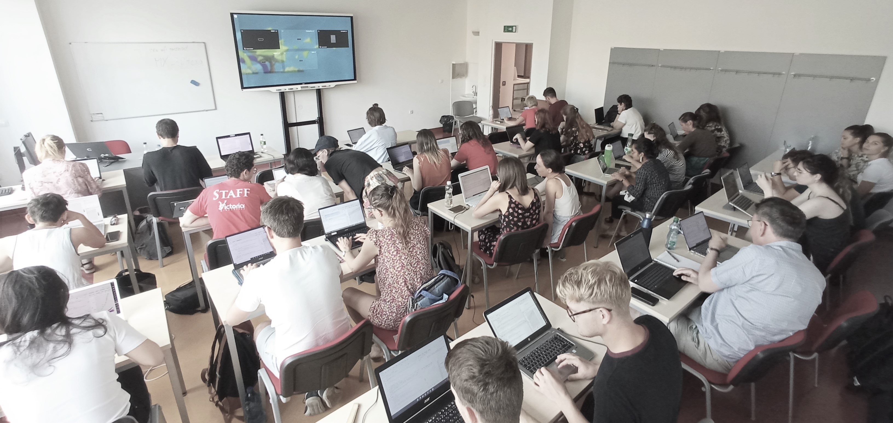
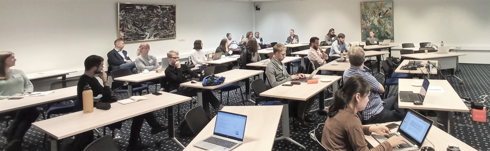
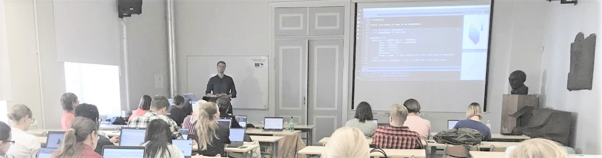
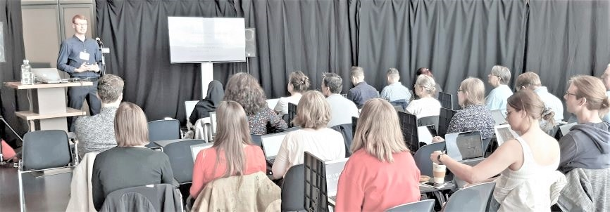
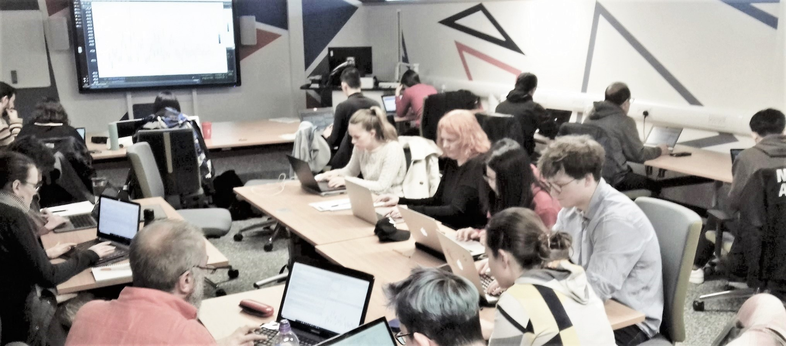
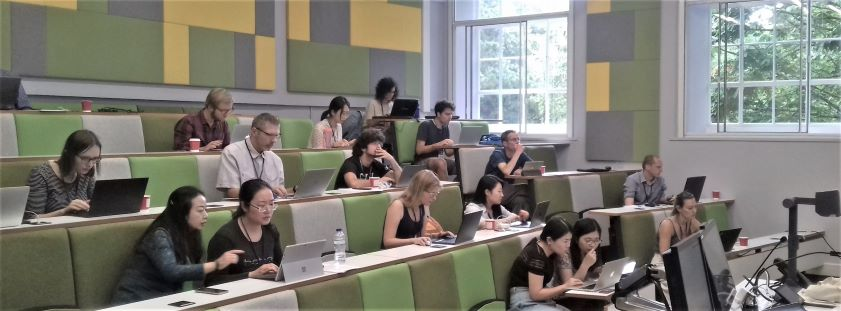

Datafigure OÜ korraldab tehisintellekti (AI), andmeteaduse, programmeerimise ja muude digipädevuste alaseid koolitusi, töötubasid ja ettekandeid. Võimalik on tellida ka üks-ühele juhendamist, ekspertarvamust, konsulteerimist ja projektipõhiseid töid.  
Koolituste puhul on formaat ja tase paindlikud - oleme korraldanud üritusi pikkusega poolest tunnist mitme päevani, ja nii algajatele kui oma ala professionaalidele. Seda nii erinevate ürituste (nt konverentside) raames, online-koolituste sarjades kui kohapeal sisekoolitustena. Meie klientideks on nii era- kui avalik sektor, koolid ja kõrgkoolid, riigiasutused kui kolmas sektor, ja nii Eestis kui mujal Euroopas.  
Allpool on kirjeldatud siiani toimunud koolituste peamised tüübid. Iga koolitus on kohandatud kliendi soovide ja vajaduste järgi, ja materjale uuendatakse pidevalt, sest kõnealused tehnoloogiad nagu AI arenevad väga kiiresti. Hinnastame pikkuse, teema keerukuse ja asukoha järgi. Koolitame nii eesti kui inglise keeles (we also do workshops in English, see [here](https://datafigure.eu/english.html)).

# Tehisintellekt ja haridus

:::{layout="[3,1]"}
Keskendume generatiivse tehisintellekti põhiste tööriistade (nt ChatGPT, Gemini, Copilot, Elicit ja Canva) ning agentsete AI-tööriistade (nt Codex, Claude Code ja Cowork) kasutamisele. Arutleme, kuidas need tehnoloogilised edusammud mõjutavad haridust, õppimist ja õpetamist nii praegu kui lähitulevikus. Mõtestame tehisintellekti kasutamist hariduses ning õpime töötama nii tehisabiliste kui ka agentidega, mis suudavad iseseisvamalt kavandada ja ellu viia mitmeastmelisi ülesandeid. See on vajalik oskus, eriti nüüd, kus Eestis on välja kuulutatud uus [TI-hüpe](https://tihupe.ee/), mis näeb ette ChatGPT taoliste assistentide laialdast kasutust nii õpilaste kui õpetajate poolt. Vastavalt publikule keskendub ettekanne ja praktilised näited kas üldharidusele või kõrgharidusele. Koolitus võib vastavalt soovile olla nt tunniajane sissejuhatus või pikem 3-4h üritus, kus osalejad kohe neid tööriistu praktiliste harjutuste kaudu õppima ja kogemusi jagama suunatakse.

  

:::

# Tehisintellekt ja organisatsioon

:::{layout="[3,1]"}
Fookus on samuti praktilistel AI-tööriistadel, aga keskendudes sellele, kuidas oma sektoris neid kõige paremini tööülesannete kiiremaks lahendamiseks ära kasutada, kuidas harjutada tehisassistentide ja agentidega koos töötamist, aga ka kuidas mõtestada tööpostil õppimist ja praktikat olukorras, kus AI on tihti võimeline algaja töötaja tööülesandeid täitma. Soovi korral puudutame ka laiema automatiseerimise temaatikat: kui näiteks ChatGPT või Copiloti abil saab kiirelt ühte-kahte dokumenti kokku võtta ja töödelda või ühekaupa e-kirju kirjutada, siis agentsed AI-tööriistad nagu Codex, Claude Code ja Cowork saavad kavandada ning ellu viia pikemaid, mitmeastmelisi töövooge. Neid tööriistu käitavate keelemudelite abil on võimalik tavaliselt väikese IT-arendusega automatiseerida erinevaid protsesse palju suuremal skaalal. Soovi korral võib koolitus keskenduda kitsamalt ka tehisintellekti ja produktiivsuse tõstmise teemale.

:::

# AI ja analüütika

Suurte keelemudelite abil on võimalik kiiresti ja efektiivselt teostada andmeanalüütikat, mis veel hiljuti oleks vajanud iga uue küsimuse või probleemi jaoks eraldi masinõppemudeli treenimist. Nendel koolitustel oleme vaadanud erinevate keele- ja multimodaalsete mudelite võimekusi kvalitatiivsete andmete (tekstid, pildid) analüüsimisel ning praktiliste näidete abil näidanud, kuidas sellega võimestada nii andmeanalüüsi kui ka protsesside automatiseerimist. Väiksemas mahus andmeanalüüsi võimaldavad mitmed juturobotid nagu ChatGPT. Agentsed AI-tööriistad nagu Codex või Claude Code võivad aga aidata kavandada ja ellu viia terviklikuma analüüsiprotsessi: töödelda andmeid, jooksutada koodi, luua statistilisi mudeleid ja graafikuid ning dokumenteerida tulemusi.

# Andmeteadus ja R

::::{layout="[3,1]"}

:::{}

Need on enamasti olnud algtaseme praktilised töötoad, mis on sageli suunatud inimestele, kellel on oma valdkonnas (näiteks humanitaar- või sotsiaalteadustes) kõrgtasemel oskused, kuid vähesed või puuduvad programmeerimisoskused. Tüüpiline ühepäevane töötuba sisaldab sissejuhatust programmeerimiskeelde R, millele järgneb andmete visualiseerimise ja/või töötlemise praktika.
Miks on hea alustada andmete visualiseerimisest? Sest (1) see on nagunii teadustöö lahutamatu osa ning (2) programmeerimist on lõbusam õppida, kui saad kohe oma esimesi koodikatsetusi näha ja tõlgendada (ja R'is on ilusate graafikute loomine väga lihtne ja intuitiivne, eriti pakettidega nagu ggplot2 ja plotly).

:::

:::{}

  

:::

::::

# Häkatonid

:::{layout="[3,1]"}
Oleme nii korraldanud kui aidanud kokku panna häkatone. Need on tavaliselt olnud kombineeritud eelneva praktilise töötoaga mõnel ülal nimetatud teemal. Häkatonil võime ka aidata teemavaldkonna tutvustamisega, pakkuda võimalikke andmestikke, suunata tiimide tööd (mentorlus) või pakkuda tehnilisi lahendusi ja abi probleemide lahendamisel.

:::

# Kohandatud koolitused ja erilahendused

:::{layout="[3,1]"}
Huvide kattumise korral oleme hea meelega valmis kohandama kursuse, töötoa või häkatoni vastavalt tellija ja tema kollektiivi või õpilaste õpivajadustele ja huvidele. Võib julgelt ühendust võtta ja arutada, et parim lahendus leida.

  

:::

